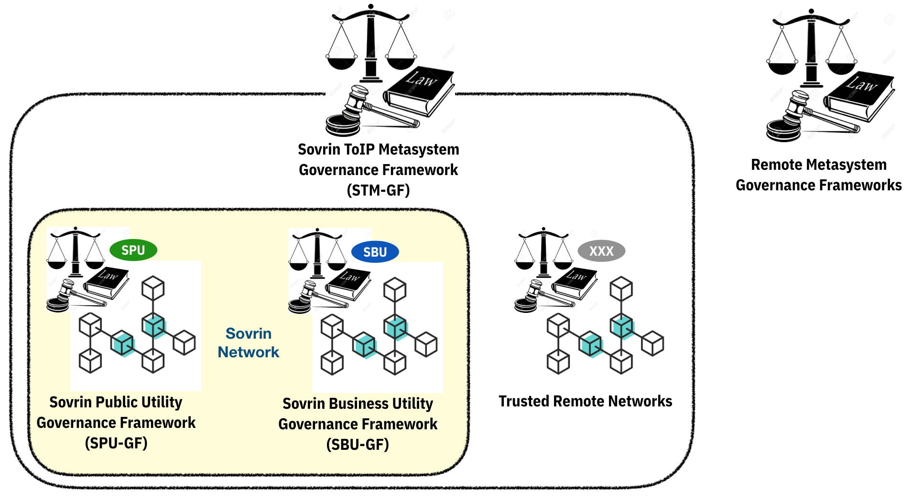
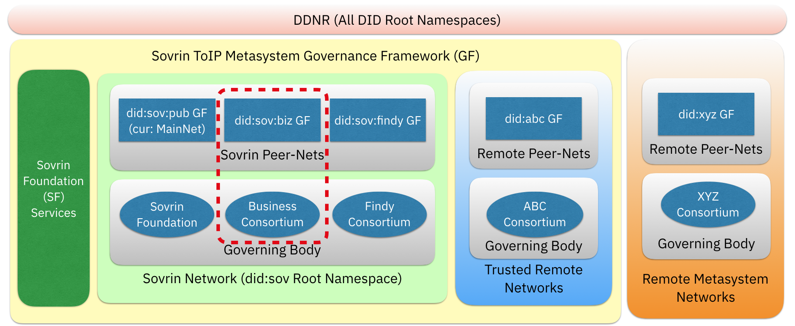

## Metasystem
The [Sovrin ToIP Metasystem Governance Framework (STM-GF)]() provides the legal governance for all participating entities within the Sovrin ToIP Metasystem (STM) or **Sovrin Ecosystem**. The STM is comprised of DID Ledgers ("Peer-Nets") that are either part of the Sovrin Network (did:sov) or a trusted DID Ledger associated with a unique DID Root Namespace.

## Sovrin Network
A collection of Peer-Nets that all adhere to the STM-GF but are managed as independent Identity Utilities each having its own Governance framework. Minimally there are two Peer-Nets within the Sovrin Network:

* Sovrin Public Utility (*did:sov:pub*)
* Sovrin Business Utility (*did:sov:biz*)

## Sovrin Business Utility

The Sovrin Business Utility ("SBU") is intended to serve as a safe-zone for organizations that desire to participate in the Sovrin Ecosystem but require an enterprise grade governance framework that will:

* Enforce Permissioned Writes with contractual instruments that will ease GDPR concerns
* Establish financial sustainability of the Consortium without the use of Tokens
* Establish a governing board so no single organization owns the DID Ledger
* Require adherences to a specific stack of open standards and protocols

To meet these requirements, the SBU is an independently operated Peer-Net. A consortium of organizations operate the SBU as a public identity utility under its own governance framework. Consortium members pay annual membership fees and provide supporting infrastructure to maintain a sustainable permissioned identity utility that is structured as an enterprise safe-space and purpose built for trusted commerce. As a Peer-Net within the Sovrin Network, the consortium leverages the Sovrin Foundation as a fee-based provider for the administration and delivery of a the DID Ledger associated with the *did:sov:biz* namespace.
